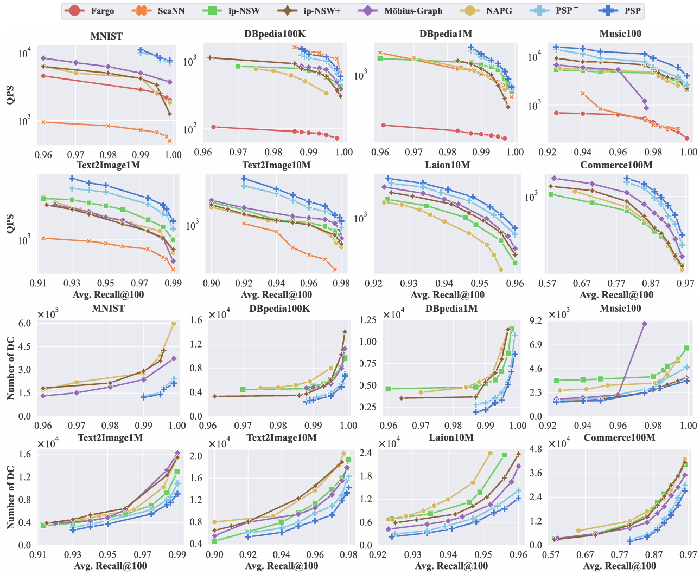

<h1 align="center">PSP - Proximity Graph with Spherical Pathway for MIPS </h1> 

This repository contains the source code for our paper: **Maximum Inner Product is Query-Scaled Nearest Neighbor** (VLDB25).

**If you're interested, you can also check out our further extended work: [SIGIR2025 MAG](https://github.com/ZJU-DAILY/MAG)**
## 1 Abstract

This paper presents a novel theoretical framework that equates MIPS with NNS without requiring space transformation, thereby allowing us to leverage advanced graph-based indices for NNS and efficient edge pruning strategies, significantly reducing unnecessary computations. 

## 2 Competitors
> The initial code for ip-nsw and ip-nsw+ came from the original papers, and we reconstructed the relevant code using hnswlib 0.8.0. For Möbius-graph and NAPG, we did not find available open-source code, so we implemented our own version, which will also be open-sourced for relevant evaluations. ScaNN is a commercial product, so we used the open-source version of the code, it achieves excellent results through careful parameter tuning. Its official examples do not enable multithreading. If you are conducting evaluations using multithreading, please invoke the relevant functions. 

* ip-NSW ([Paper](https://proceedings.neurips.cc/paper_files/paper/2018/file/229754d7799160502a143a72f6789927-Paper.pdf)): A graph based method using inner product navigable small world graph. 

* ip-NSW+ ([Paper](https://aaai.org/ojs/index.php/AAAI/article/view/5344/5200)): An enhancement of ip-NSW that introduces an additional angular proximity graph.
* Möbius-Graph ([Paper](https://proceedings.neurips.cc/paper/2019/file/0fd7e4f42a8b4b4ef33394d35212b13e-Paper.pdf)): A graph based method that reduces the MIPS problem to an NNS problem using Möbius transformation. Since the original code is not available, we implemented a version based on the paper.
* NAPG ([Paper](https://dl.acm.org/doi/abs/10.1145/3447548.3467412)): A recent graph-based method claiming state-of-the-art performance by improving ip-NSW with a specialized metric, using an adaptive $\alpha$ for different norm distributions.
* Fargo ([Paper](https://www.vldb.org/pvldb/vol16/p1100-zheng.pdf)): The latest state-of-the-art LSH based method with theoretical guarantees.
* ScaNN ([Paper](http://proceedings.mlr.press/v119/guo20h/guo20h.pdf)): The state-of-the-art quantization method.
## 3 Datasets

The data format is: Number of vector (n) * Dimension (d).

*: Data source will be released upon publication.

| Dataset                                                      | Base Size   | Dim  | Query Size | Modality   |
| ------------------------------------------------------------ | ----------- | ---- | ---------- | ---------- |
| MNIST ([link](https://yann.lecun.com/exdb/mnist/index.html)) | 60,000      | 784  | 10,000     | Image      |
| DBpedia100K ([link](https://huggingface.co/datasets/Qdrant/dbpedia-entities-openai3-text-embedding-3-large-3072-100K)) | 100,000     | 3072 | 1,000      | Text       |
| DBpedia1M ([link](https://huggingface.co/datasets/Qdrant/dbpedia-entities-openai3-text-embedding-3-large-1536-1M)) | 1,000,000   | 1536 | 1,000      | Text       |
| Music100 ([link](https://github.com/stanis-morozov/ip-nsw))  | 1,000,000   | 100  | 10,000     | Audio      |
| Text2Image1M ([link](https://research.yandex.com/blog/benchmarks-for-billion-scale-similarity-search)) | 1,000,000   | 200  | 100,000    | Multi      |
| Text2Image10M ([link](https://research.yandex.com/blog/benchmarks-for-billion-scale-similarity-search)) | 10,000,000  | 200  | 100,000    | Multi      |
| Laion10M ([link](https://arxiv.org/abs/2210.08402)) | 12,244,692      | 512  | 1,000      | Multi      |
| Commerce100M*                                                | 100,279,529 | 48   | 64,111     | E-commerce |

## 4 Building Instruction

### Prerequisites

- GCC 4.9+ with OpenMP
- CMake 2.8+
- Boost 1.55+
- Faiss (optional)

### Compile On Linux

```shell
$ mkdir build/ && cd build/
$ cmake ..
$ make -j
```

## 5 Usage

### Code Structure

- **datasets**: datasets
- **include**: C++ class interface
- **output**: PSP index, k-MIP result file
- **script**: some scripts to run the experiments
- **src**: main function implementation
- **test**: test codes

### How to use

#### Step 1. Build kNN Graph

Firstly, we need to prepare a kNN graph.  You can use Faiss and other libs.

#### Step 2. PSP indexing

```shell
./test/test_mips_index DATA_PATH KNNG_PATH L R Angle M PSP_PATH DIM
```

- `DATA_PATH` is the path of the base data in `bin` format.
- `KNNG_PATH` is the path of the pre-built kNN graph in *Step 1.*.
- `L` candidate pool size.
- `R`maximum out-degree.
- `Angle` minimal angle between edges.
- `M` IP neighbor.
- `PSP_PATH` is the path of the generated PSP index.
- `DIM` dimension of dataset.

#### Step 3. PSP searching

```shell
./test/test_mips_search DATA_PATH QUERY_PATH PSP_PATH searh_L K RESULT_PATH DIM
```

- `DATA_PATH` is the path of the base data in `bin` format.
- `QUERY_PATH` is the path of the query data in `bin` format.
- `PSP_PATH` is the path of the generated PSP index.
- `search_L` search pool size, the larger the better but slower (must larger than K).
- `K` the result size.
- `PSP_PATH` is the path of the result neighbors.
- `DIM` dimension of dataset.

## 6 To-Do Lists
- ✅ Open-source code is available for the major components of the original paper.
- ✅ Real-world evaluation scenarios of Commerce100M on the Shopee platform.
- 🔄 More automated entry point selection and early stopping techniques.
- 🔄 Improve compatibility of SIMD-related PQ codes.
- 🔄 Python wrapper.
- 🔄 A wider range of datasets with diverse norm distributions.
## 7 Performance

#### Evaluation Metric

- QPS, Distance computation (for graph-based method)


